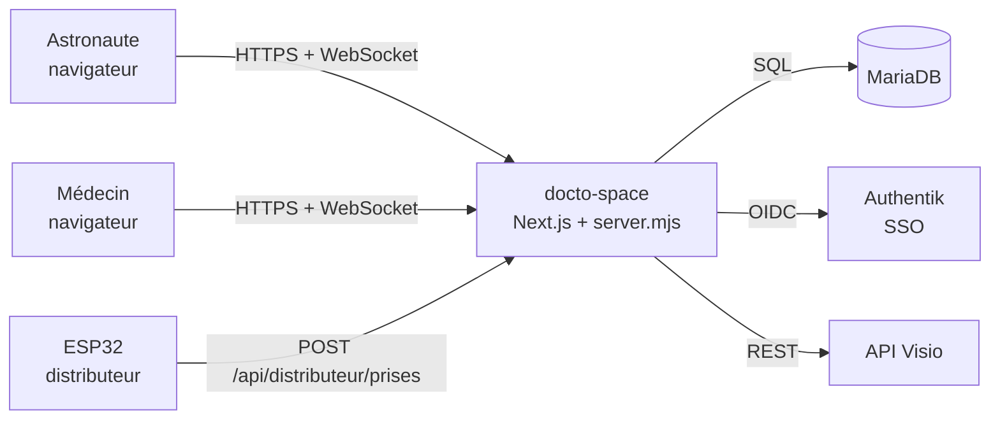
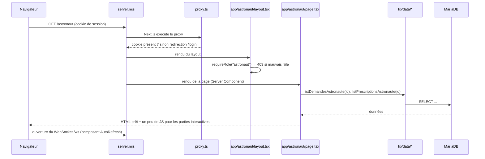

# Fiche 01 — Vue d'ensemble

## La stack

| Couche | Technologie | Rôle dans le projet |
|--------|-------------|---------------------|
| Framework | **Next.js 16** (App Router) + **React 19** | Pages, API, logique serveur, tout dans un seul projet |
| Langage | **TypeScript** | Typage de bout en bout (même les requêtes SQL via Prisma) |
| Base de données | **MariaDB** via **Prisma 7** | Stockage des utilisateurs, demandes, prescriptions, prises |
| Authentification | **Auth.js v5** (`next-auth`) + **Authentik** (SSO OIDC) | Connexion, rôles médecin/astronaute |
| Temps réel | **WebSocket** (`ws`) dans un serveur Node custom | Rafraîchir les pages quand quelque chose change |
| Validation | **Zod** | Vérifier ce qui arrive des formulaires et de l'ESP32 |
| UI | **Tailwind CSS v4**, **shadcn** (sur **Base UI**), **Phosphor Icons**, **Sonner** | Composants, styles, icônes, toasts |
| Externe | API **Visio** (La Suite Numérique) | Créer les salles de visioconférence |
| Matériel | **ESP32** + lecteur RFID | Distributeur de médicaments |
| Déploiement | **Docker**, **GitHub Actions**, VPS + nginx | Mise en production à chaque push sur `main` |

Gestionnaire de paquets : **pnpm** (`pnpm install`, `pnpm dev`).

## Les acteurs



## L'arborescence, dossier par dossier

```
app/                    ← les ROUTES (chaque dossier = un segment d'URL)
  layout.tsx            ← squelette HTML commun à toutes les pages
  page.tsx              ← "/" : redirige selon le rôle
  login/page.tsx        ← "/login"
  forbidden.tsx         ← page 403
  astronaut/            ← "/astronaut/..." (protégé : rôle astronaut)
    layout.tsx          ← vérifie le rôle + header + temps réel
    page.tsx            ← tableau de bord astronaute
    demandes/nouvelle/  ← "/astronaut/demandes/nouvelle"
    notifications/
  doctor/               ← "/doctor/..." (protégé : rôle doctor)
  api/                  ← endpoints HTTP "classiques" (Route Handlers)
    auth/[...nextauth]/ ← callbacks OIDC gérés par Auth.js
    medicaments/        ← recherche dans le référentiel (combobox)
    distributeur/prises ← appelé par l'ESP32

components/             ← composants React réutilisables
  ui/                   ← composants shadcn "bruts" (button, dialog…)
  *.tsx                 ← composants métier (bouton d'annulation, cloche…)

lib/                    ← toute la logique qui n'est pas de l'affichage
  prisma.ts             ← client de base de données
  dal.ts                ← "Data Access Layer" : requireSession / requireRole
  data/                 ← LECTURES en base (fonctions appelées par les pages)
  actions/              ← ÉCRITURES en base (Server Actions)
  validation/           ← schémas Zod
  events.ts             ← pub/sub temps réel (côté Next)
  visio.ts              ← client de l'API Visio
  datetime.ts, prises.ts, slots.ts, consultations.ts ← règles métier pures

prisma/
  schema.prisma         ← modèle de données
  migrations/           ← historique SQL du schéma
  seed.ts + data/       ← import du référentiel des médicaments

auth.ts                 ← configuration Auth.js
proxy.ts                ← garde exécutée avant chaque requête protégée
server.mjs              ← serveur Node custom : Next.js + WebSocket
Dockerfile, deploy/, .github/workflows/ ← déploiement
```

**La règle d'or de l'organisation** : `app/` décide *quoi afficher*, `lib/`
décide *quoi faire*. Une page ne contient jamais de requête Prisma écrite en
ligne : elle appelle une fonction de `lib/data/`. Un formulaire n'écrit jamais
en base directement : il appelle une action de `lib/actions/`.

## Le trajet d'une requête (lecture)

Exemple : l'astronaute ouvre `/astronaut`.



## Le trajet d'une écriture

Exemple : le médecin accepte une demande.

1. Le formulaire du dialogue (`app/doctor/demande-actions.tsx`, composant
   client) appelle la Server Action `accepterDemande` (`lib/actions/demandes.ts`).
2. L'action vérifie le rôle (`requireRole("doctor")`), valide les champs avec
   Zod, crée une salle Visio, met à jour la demande **et** crée la notification
   dans une même transaction.
3. Elle appelle `notifyUsers([...])` → le serveur WebSocket envoie `"refresh"`
   aux navigateurs concernés (l'astronaute et les autres médecins).
4. Elle appelle `refresh()` → la page du médecin se re-rend avec les nouvelles
   données, et renvoie `{ status: "success" }` → un toast s'affiche.
5. Chez l'astronaute, `AutoRefresh` reçoit `"refresh"` et appelle
   `router.refresh()` → sa page se met à jour sans rechargement.

Tout le reste du projet est une variation de ces deux trajets.

## Lancer le projet en local

```bash
pnpm install
# créer .env.local avec les variables de deploy/.env.example
# (DATABASE_URL vers ta MariaDB locale, AUTHENTIK_*, AUTH_SECRET…)
pnpm exec prisma migrate dev   # crée les tables
pnpm exec prisma db seed       # importe le référentiel des médicaments
pnpm dev                       # = node server.mjs (et pas `next dev` !)
```

> ⚠️ `pnpm dev` lance `server.mjs`, pas `next dev` : c'est ce qui permet au
> WebSocket de fonctionner (voir fiche 06).
