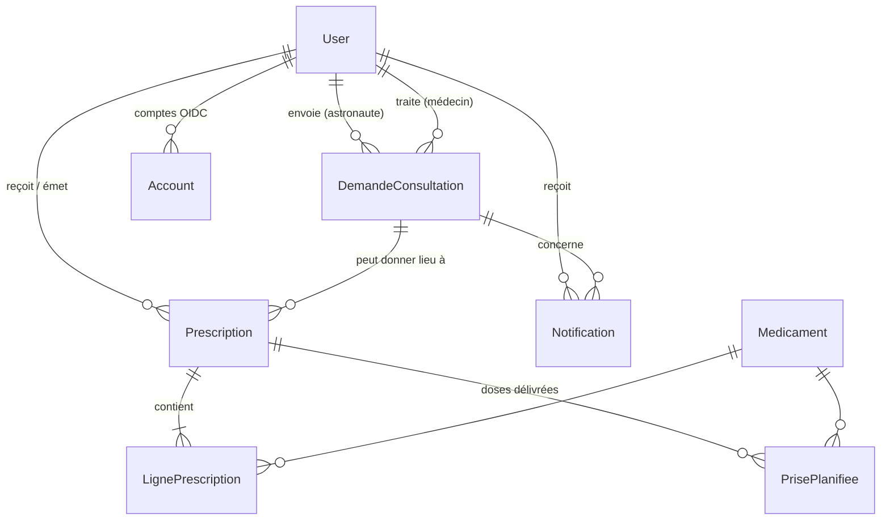

# Fiche 03 — Base de données : Prisma + MariaDB

## Le principe d'un ORM

Au lieu d'écrire du SQL à la main, on décrit les tables dans un fichier
(`prisma/schema.prisma`) et Prisma :

1. génère les **migrations SQL** qui créent/modifient les tables ;
2. génère un **client TypeScript typé** : `prisma.prescription.findMany(...)`
   sait exactement quels champs existent, et le résultat est typé.

## Les fichiers

| Fichier | Rôle |
|---------|------|
| `prisma/schema.prisma` | La source de vérité du modèle de données |
| `prisma/migrations/*/migration.sql` | L'historique SQL, appliqué dans l'ordre. **À committer.** |
| `prisma.config.ts` | Config du CLI Prisma (où est le schéma, l'URL, la commande de seed) |
| `lib/prisma.ts` | Le client utilisé par l'application |
| `prisma/seed.ts` | Remplit la table `Medicament` depuis `prisma/data/medicaments-bdpm.tsv` |

## Le modèle de données



- **`User`, `Account`, `Session`, `VerificationToken`** : modèles imposés par
  Auth.js (ne pas renommer les champs). On y a ajouté `role`, `specialite`,
  `rfidUid`.
- **`DemandeConsultation`** : cycle de vie `EN_ATTENTE → VALIDEE | REFUSEE`,
  puis `VALIDEE → ANNULEE`.
- **`Prescription`** + **`LignePrescription`** : une ordonnance et ses lignes
  (un médicament + une posologie chacune).
- **`Medicament`** : le référentiel officiel, en lecture seule pour l'appli.
- **`PrisePlanifiee`** : chaque dose délivrée par le distributeur.
- **`Notification`** : la cloche.

### Quelques notions de schéma illustrées

```prisma
model DemandeConsultation {
  id           String   @id @default(uuid())      // clé primaire générée
  astronaute   User     @relation("DemandesAstronaute", fields: [astronauteId], references: [id])
  astronauteId String                              // la vraie colonne (clé étrangère)
  medecinId    String?                             // ? = nullable
  statut       StatutDemande @default(EN_ATTENTE)  // enum
  commentaire  String   @db.Text                   // type SQL précis
  updatedAt    DateTime @updatedAt                 // mis à jour automatiquement
  @@index([statut])                                // index SQL
}
```

- **Relations nommées** (`"DemandesAstronaute"`, `"DemandesMedecin"`) :
  obligatoires quand deux relations relient les mêmes tables (une demande a
  un astronaute ET un médecin, tous deux des `User`).
- **`onDelete: Cascade`** : supprimer une prescription supprime ses lignes.
  **`onDelete: SetNull`** : supprimer une demande laisse la prescription, avec
  `demandeId = null`.
- **`@@unique([prescriptionId, medicamentId, dateHeurePrevue])`** sur
  `PrisePlanifiee` : c'est la base de données qui garantit qu'une dose ne peut
  pas être délivrée deux fois pour le même créneau.

## Le client (`lib/prisma.ts`)

```ts
const adapter = new PrismaMariaDb(process.env.DATABASE_URL!);
export const prisma = globalForPrisma.prisma ?? new PrismaClient({ adapter });
if (process.env.NODE_ENV !== "production") globalForPrisma.prisma = prisma;
```

- Prisma 7 se connecte via un **driver adapter** (`@prisma/adapter-mariadb`).
- L'astuce `globalThis` : en dev, Next recharge les modules à chaque
  modification ; sans ça on créerait un nouveau pool de connexions à chaque
  sauvegarde de fichier et on saturerait MariaDB.

## Les requêtes courantes

```ts
// Lire avec filtre, relation incluse, tri
prisma.demandeConsultation.findMany({
  where: { statut: "EN_ATTENTE", medecinId: null },
  include: { astronaute: { select: { name: true, email: true } } },
  orderBy: { dateSouhaitee: "asc" },
});

// Créer avec des enfants en une fois (nested write)
tx.prescription.create({ data: { astronauteId, medecinId, lignes: { create: data } } });
```

`select` = ne ramener que certains champs, `include` = ajouter une relation.
Les types de retour suivent automatiquement : on les réutilise ainsi
(`lib/data/prescriptions.ts`) :

```ts
export type PrescriptionMedecin = Awaited<ReturnType<typeof listPrescriptionsMedecin>>[number];
```

## Deux patterns importants du projet

### 1. Les transactions

Quand plusieurs écritures doivent réussir ou échouer ensemble :

```ts
await prisma.$transaction(async (tx) => {
  await tx.demandeConsultation.updateMany(...);
  await tx.notification.create(...);
}); // si une ligne lève une erreur, tout est annulé
```

Toujours utiliser `tx` (et pas `prisma`) à l'intérieur.

### 2. L'update conditionnel contre les « courses »

Deux médecins cliquent sur « Accepter » la même demande à la même seconde.
Un `findUnique` puis `update` laisserait passer les deux. À la place :

```ts
const { count } = await tx.demandeConsultation.updateMany({
  where: { id: demandeId, statut: "EN_ATTENTE", medecinId: null }, // la condition
  data: { statut: "VALIDEE", medecinId: session.user.id, ... },
});
if (count === 0) return false; // quelqu'un est passé avant
```

La vérification et l'écriture sont une seule requête SQL, donc atomiques. On
retrouve ce pattern dans `accepterDemande`, `refuserDemande`,
`annulerConsultation`. Le distributeur va plus loin avec un
`SELECT ... FOR UPDATE` (fiche 08).

## Le cycle de travail

```bash
# 1. modifier prisma/schema.prisma
# 2. générer + appliquer la migration en local
pnpm exec prisma migrate dev --name ajout_truc
# 3. relire le SQL généré dans prisma/migrations/…/migration.sql
# 4. committer schema.prisma ET le dossier de migration
```

En production, le conteneur `migrate` exécute `prisma migrate deploy`
(applique les migrations manquantes, sans rien générer) puis
`prisma db seed` (fiche 10).

> 💡 On peut éditer le SQL d'une migration avant de la committer. Exemple :
> `20260923020000_quantite_entiere` convertit un texte libre (« 2 comprimés »)
> en nombre **en conservant les données existantes**, ce que Prisma n'aurait
> pas su faire seul (il aurait supprimé puis recréé la colonne).

## Le seed

`prisma/seed.ts` lit le fichier TSV du référentiel (~13 600 médicaments) et
l'insère par paquets de 1000 avec `skipDuplicates: true`. Il est
**idempotent** : le relancer ne fait rien si tout est déjà là, donc on peut le
lancer à chaque déploiement. Le fichier est versionné pour que le déploiement
ne dépende pas d'un site externe ; `scripts/refresh-bdpm.sh` le régénère.
