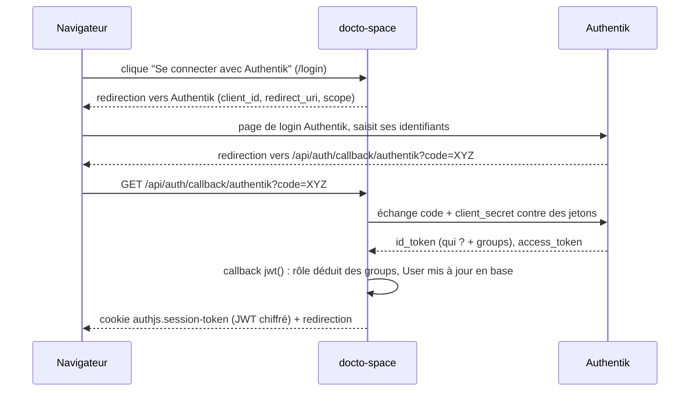

# Fiche 04 — Authentification SSO : OIDC, Authentik et Auth.js

## Les acteurs

- **Authentik** : le *fournisseur d'identité* (IdP). C'est lui qui connaît les
  mots de passe et les groupes (`doctor`, `astronaut`). Il est hébergé à part.
- **Auth.js** (paquet `next-auth` v5) : la bibliothèque côté Next.js qui parle
  à Authentik et gère le cookie de session.
- **OIDC** (*OpenID Connect*) : le protocole standard qu'ils utilisent entre eux.

L'application **ne voit jamais de mot de passe**. Elle délègue la connexion à
Authentik et reçoit en retour une preuve signée de l'identité de l'utilisateur.

## Le flow de connexion (Authorization Code Flow)



Points clés :
- Le `code` transite par le navigateur, mais il est inutile sans le
  `client_secret`, que seul le serveur connaît.
- `/api/auth/[...nextauth]/route.ts` expose simplement les handlers d'Auth.js :
  c'est lui qui reçoit le callback.
- La **redirect URI** doit être déclarée dans Authentik :
  `https://<domaine>/api/auth/callback/authentik`.

## La configuration (`auth.ts`)

```ts
export const { handlers, auth, signIn, signOut } = NextAuth({
  adapter: PrismaAdapter(prisma),     // crée/relie les lignes User et Account
  providers: [Authentik({ clientId, clientSecret, issuer, wellKnown, ... })],
  session: { strategy: "jwt" },       // session stockée dans le cookie
  pages: { signIn: "/login" },
  callbacks: { jwt, session },
});
```

Ce fichier exporte 4 choses utilisées partout :

| Export | Usage |
|--------|-------|
| `auth()` | Lire la session courante (dans un Server Component, une action, le proxy) |
| `signIn("authentik")` | Démarrer le flow (page `/login`) |
| `signOut()` | Supprimer le cookie (utilisé par `lib/logout.ts`) |
| `handlers` | `GET`/`POST` de `/api/auth/*` |

### Pourquoi un adapter Prisma ET des sessions JWT ?

- L'**adapter** crée une ligne `User` à la première connexion. On en a besoin
  car les tables métier (`DemandeConsultation.astronauteId`…) pointent vers
  `User.id`.
- La **stratégie JWT** évite une requête en base à chaque page : tout ce dont
  on a besoin (id, rôle) est dans le cookie, signé et chiffré avec
  `AUTH_SECRET`. C'est aussi ce qui permet à `server.mjs` de lire la session
  sans base de données (fiche 06).

### Les callbacks : d'où vient le rôle ?

```ts
async jwt({ token, profile, account }) {
  if (profile) {                                  // uniquement juste après le login
    const role = roleFromGroups(profile.groups);  // ["doctor"] → "doctor"
    token.role = role;
    await prisma.user.update({ where: { id: token.sub }, data: { role: ROLE_TO_DB_ROLE[role] } });
  }
  if (account?.id_token) token.idToken = account.id_token; // pour le logout
  return token;                                   // → stocké dans le cookie
},
async session({ session, token }) {               // ce que auth() renvoie
  session.user.id = token.sub;
  session.user.role = token.role;
  return session;
}
```

- **Authentik est la source de vérité** pour les rôles : un utilisateur est
  médecin s'il est dans le groupe `doctor` d'Authentik. Le scope `profile`
  fait apparaître la liste `groups` dans l'`id_token`.
- On recopie le rôle dans `User.role` en base parce que certaines requêtes en
  ont besoin (« notifier tous les médecins »).
- Deux vocabulaires cohabitent : `doctor`/`astronaut` (JWT, URLs) et
  `MEDECIN`/`ASTRONAUTE` (base). La traduction est centralisée dans
  `lib/roles.ts`.
- `types/next-auth.d.ts` étend les types d'Auth.js pour que
  `session.user.role` et `token.idToken` soient reconnus par TypeScript.

## Les trois niveaux de protection

| Niveau | Fichier | Ce qu'il vérifie | Si échec |
|--------|---------|------------------|----------|
| 1. Proxy | `proxy.ts` | Il y a une session | Redirection `/login?callbackUrl=…` |
| 2. Layout | `app/doctor/layout.tsx` → `requireRole("doctor")` | Le **rôle** est le bon | 403 via `forbidden()` |
| 3. Action / données | `requireRole(...)` dans chaque action, filtre `where: { userId: session.user.id }` | Le rôle, et que la ressource appartient à l'utilisateur | Erreur renvoyée |

**Pourquoi répéter la vérification dans chaque Server Action ?** Parce qu'une
Server Action est un endpoint HTTP public : n'importe qui peut l'appeler
directement sans passer par la page. Le layout ne la protège pas.

**Pourquoi filtrer sur `session.user.id` ?** Pour qu'un astronaute ne puisse
jamais lire les données d'un autre en modifiant un id dans une requête. On ne
fait **jamais** confiance à un id venu du client pour décider « à qui
appartiennent les données ».

```ts
// lib/dal.ts
export async function requireRole(role: Role) {
  const session = await requireSession(); // redirige vers /login si absent
  if (session.user.role !== role) forbidden();
  return session;
}
```

## La déconnexion (`lib/logout.ts`)

Piège classique du SSO : `signOut()` ne supprime **que** le cookie de
l'application. La session chez Authentik reste ouverte, donc au clic suivant
sur « Se connecter », Authentik reconnecte l'utilisateur sans rien demander.

La solution est le **RP-Initiated Logout** :

1. Relire le JWT pour récupérer l'`idToken` stocké au login.
2. `signOut({ redirect: false })` → supprime le cookie local.
3. Rediriger vers `<issuer>end-session/?id_token_hint=…&post_logout_redirect_uri=…/login`
   → Authentik ferme sa propre session puis renvoie sur `/login`.

## Les variables d'environnement

```
AUTH_SECRET              clé de chiffrement des JWT (openssl rand -base64 32)
AUTH_URL                 URL publique de l'app (prod)
AUTH_TRUST_HOST=true     derrière nginx : faire confiance aux en-têtes Host
AUTHENTIK_CLIENT_ID / AUTHENTIK_CLIENT_SECRET
AUTHENTIK_ISSUER         AVEC le slash final (…/application/o/docto-space/)
```

## Pièges rencontrés (documentés dans le code)

- **Slash final de l'issuer** : Authentik renvoie l'issuer avec un `/` final
  et Auth.js veut une égalité stricte → on garde le slash, mais on définit
  `wellKnown` à la main pour éviter `//.well-known`.
- **Cookie `__Secure-`** : en HTTPS, le cookie s'appelle
  `__Secure-authjs.session-token`. `getToken()` doit le savoir
  (`secureCookie: true`), sinon il renvoie `null` sans erreur.
- **`0.0.0.0` dans les URL** : `server.mjs` écoute sur `0.0.0.0` mais déclare
  `localhost` à Next, sinon la `redirect_uri` contiendrait `0.0.0.0` et
  Authentik la refuserait.
