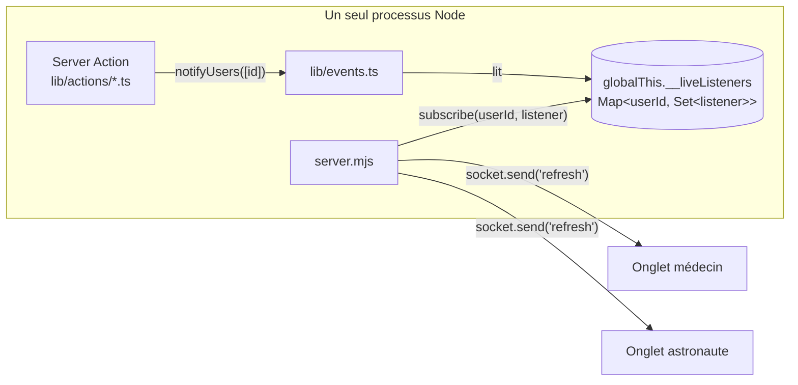

# Fiche 06 — Temps réel : WebSocket

## Le besoin

Quand l'astronaute envoie une demande, le médecin doit la voir apparaître
**sans recharger sa page**. HTTP classique ne le permet pas : c'est toujours
le navigateur qui demande, jamais le serveur qui envoie.

## Qu'est-ce qu'un WebSocket ?

Une connexion qui démarre comme une requête HTTP (`GET /ws` avec l'en-tête
`Upgrade: websocket`), puis reste **ouverte** : le serveur et le navigateur
peuvent s'envoyer des messages à tout moment, dans les deux sens.

```js
const socket = new WebSocket("wss://exemple.fr/ws");
socket.onmessage = (event) => console.log(event.data);
```

## Le choix de conception : « signal », pas « données »

Le serveur n'envoie **jamais de données** par le WebSocket. Il envoie un seul
mot : `"refresh"`. Le navigateur réagit en appelant `router.refresh()`, qui
re-demande le rendu serveur de la page (avec les contrôles d'accès habituels).

Avantages : un seul chemin pour lire les données (les Server Components), pas
de risque d'envoyer une info à la mauvaise personne, pas de format de message
à maintenir.

## Pourquoi un serveur custom (`server.mjs`) ?

Next.js ne sait pas garder un WebSocket ouvert dans un Route Handler : la
connexion est fermée dès que la réponse est terminée. On lance donc Next.js
**à l'intérieur** de notre propre serveur HTTP Node :

```js
const app = next({ dev, hostname, port });
await app.prepare();
const server = createServer((req, res) => handle(req, res)); // HTTP → Next

server.on("upgrade", async (req, socket, head) => {
  if (pathname !== "/ws") return handleUpgrade(req, socket, head); // HMR de Next en dev
  const userId = await userIdFromRequest(req);   // lit le cookie de session
  if (!userId) { socket.write("HTTP/1.1 401 ..."); socket.destroy(); return; }
  wss.handleUpgrade(req, socket, head, (ws) => wss.emit("connection", ws, req, userId));
});
```

Conséquences :
- `pnpm dev` et `pnpm start` lancent `node server.mjs`, **pas** `next dev`.
- `server.mjs` est en JavaScript pur (pas compilé par Next) : Node l'exécute
  tel quel.
- Le Dockerfile ne peut pas utiliser `output: "standalone"` (fiche 10).

## Le lien entre les actions et les sockets

Le problème : `server.mjs` (du JS Node brut) et `lib/events.ts` (compilé par
Next) sont deux « mondes » de modules différents. Ils ne peuvent pas
s'importer mutuellement. Le seul objet qu'ils partagent : **`globalThis`**.



1. À la connexion, `server.mjs` enregistre dans la `Map` un *listener* pour
   cet utilisateur : « envoie `refresh` sur ce socket ».
2. Une action appelle `notifyUsers([astronauteId, medecinId])`.
3. `notifyUsers` appelle tous les listeners de ces utilisateurs → chaque onglet
   ouvert reçoit `"refresh"`.
4. À la fermeture du socket, le listener est retiré.

Un utilisateur avec 3 onglets a 3 listeners : les 3 se mettent à jour.

## L'authentification du WebSocket

Le navigateur envoie automatiquement les cookies lors de l'`upgrade`.
`server.mjs` décode le JWT d'Auth.js avec `getToken()` et le même
`AUTH_SECRET` : il obtient l'id de l'utilisateur **sans requête en base**
(c'est l'intérêt des sessions JWT, fiche 04). Pas de cookie valide → 401.

## Côté client : `components/auto-refresh.tsx`

Placé dans les layouts `doctor` et `astronaut`, donc actif sur toutes leurs
pages. Il combine trois mécanismes :

| Mécanisme | Pourquoi |
|-----------|----------|
| WebSocket → `router.refresh()` | Mise à jour instantanée (cas normal) |
| Reconnexion avec **backoff exponentiel** (1s, 2s, 4s… max 30s) + refresh à la reconnexion | Le réseau coupe, le serveur redémarre pendant un déploiement |
| Polling toutes les 30 s + refresh au retour sur l'onglet | Filet de sécurité si le socket est mort sans qu'on le sache |

N'oublie pas le **nettoyage** dans le `return` du `useEffect` : fermer le
socket, arrêter les timers, retirer les listeners. Sinon, chaque navigation
ouvrirait un socket de plus.

## Le heartbeat (ping/pong)

Toutes les 30 s, le serveur envoie un `ping` à chaque socket. Le navigateur
répond `pong` automatiquement. Un socket qui n'a pas répondu depuis le ping
précédent est considéré mort (ordinateur fermé, Wi-Fi coupé) et terminé.
Bonus : cette activité empêche nginx de couper les connexions inactives
(timeout de 60 s par défaut).

## Qui notifier ?

Chaque action choisit les destinataires :

| Événement | Notifiés |
|-----------|----------|
| Nouvelle demande | Tous les médecins |
| Demande acceptée/refusée | Tous les médecins (la liste « en attente » change) + l'astronaute |
| Consultation annulée | L'astronaute et le médecin concernés |
| Prescription créée/modifiée/supprimée | L'astronaute + le médecin (ses autres onglets) |
| Dose délivrée par l'ESP32 | L'astronaute + les médecins prescripteurs |

## La limite à connaître

La `Map` vit **dans la mémoire du processus**. Ça fonctionne parce que
l'application tourne en **une seule instance**. Avec deux conteneurs
derrière un load balancer, une action exécutée sur l'instance A ne pourrait
pas prévenir un socket connecté à l'instance B. Il faudrait alors un bus de
messages partagé (Redis pub/sub par exemple) derrière la même fonction
`notifyUsers`.

## Configuration nginx en production

La config nginx du VPS n'est pas dans le dépôt ; à titre d'exemple, le
reverse proxy doit laisser passer l'upgrade :

```nginx
location /ws {
  proxy_pass http://127.0.0.1:3000;
  proxy_http_version 1.1;
  proxy_set_header Upgrade $http_upgrade;
  proxy_set_header Connection "upgrade";
}
```
