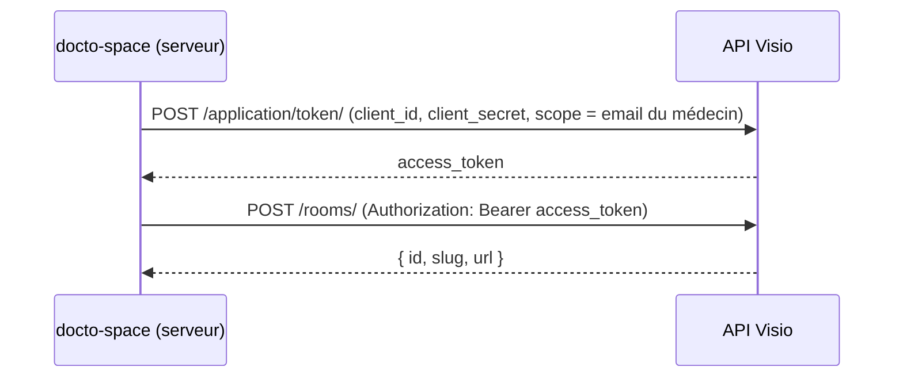

# Fiche 08 — Intégrations externes : Visio, distributeur ESP32, référentiel

Trois façons différentes de parler avec l'extérieur, trois modèles de
sécurité différents.

| Intégration | Sens | Authentification |
|-------------|------|------------------|
| API Visio | L'app **appelle** un service | OAuth 2 *client credentials* |
| Distributeur ESP32 | Un appareil **appelle** l'app | Clé partagée (Bearer) |
| Référentiel médicaments | Import de données | Aucune (fichier versionné) |

---

## 1. API Visio (La Suite Numérique / Meet)

**But** : quand un médecin accepte une demande, créer automatiquement une
salle de visioconférence et stocker son lien.

**Fichier** : `lib/visio.ts`, appelé par `accepterDemande`.

### Le flow OAuth 2 « client credentials »

C'est le flow OAuth utilisé **entre serveurs**, sans utilisateur devant
l'écran :



Le `scope` contient l'email du médecin : la salle est créée **au nom** du
médecin (délégation).

### Points de conception

- **Classe d'erreur dédiée `VisioError`** : l'action distingue « Visio est
  indisponible » (message propre à l'utilisateur) d'un bug inattendu
  (relancé).
- **Appel externe hors transaction** : on crée la salle *avant* d'ouvrir la
  transaction SQL. Ne jamais garder une transaction ouverte pendant un appel
  réseau lent. Contrepartie : si un autre médecin a accepté entre-temps, la
  salle reste orpheline (d'où le `console.warn("[visio] salle orpheline")`).
- **`cache: "no-store"`** sur les `fetch` : Next.js peut mettre en cache des
  `fetch`, ce qu'on ne veut jamais pour une création.

---

## 2. API du distributeur (ESP32)

**But** : l'astronaute scanne sa carte RFID sur le distributeur ; celui-ci
demande à l'app quels médicaments délivrer, et combien.

**Fichiers** : `app/api/distributeur/prises/route.ts` (endpoint),
`lib/data/distributeur.ts` (logique), `lib/validation/distributeur.ts`
(format de l'UID), `lib/prises.ts` (règles de calcul, fiche 09).

### Le contrat

```http
POST /api/distributeur/prises
Authorization: Bearer <DISTRIBUTEUR_API_KEY>
Content-Type: application/json

{ "uid": "39:18:b9:e3" }
```

```json
{ "autorise": true, "medicaments": [{ "id": 60234100, "quantite": 2 }] }
```

Codes d'erreur : `401` clé invalide, `400` UID mal formé, `404` carte inconnue.
L'`id` est le code CIS du médicament, converti en entier pour que l'ESP32
sache quel moteur actionner.

### Pourquoi un Route Handler et pas une Server Action ?

L'ESP32 n'est pas un navigateur : il n'a ni formulaire React, ni cookie de
session. Il lui faut un endpoint HTTP classique avec un format JSON stable.

### L'authentification par clé partagée

```ts
function cleValide(request: Request) {
  const recue = request.headers.get("authorization")?.replace(/^Bearer /, "") ?? "";
  const hash = (v: string) => createHash("sha256").update(v).digest();
  return timingSafeEqual(hash(recue), hash(attendue));
}
```

- **`timingSafeEqual`** : une comparaison `===` s'arrête au premier caractère
  différent ; en mesurant le temps de réponse, un attaquant pourrait deviner
  la clé caractère par caractère. `timingSafeEqual` prend toujours le même
  temps.
- **Le hash SHA-256** avant la comparaison : `timingSafeEqual` exige deux
  buffers de même longueur ; hacher les deux côtés le garantit.

### Normaliser les entrées

Le lecteur peut envoyer `39:18:b9:e3` ou `3918B9E3`. Le schéma Zod retire les
séparateurs et passe en majuscules, puis vérifie la longueur (4, 7 ou 10
octets). En base, `User.rfidUid` est toujours stocké sous la forme normalisée.

### Empêcher la double distribution

Deux scans quasi simultanés ne doivent pas délivrer deux fois la même dose.
`dispenserPrises()` :

1. ouvre une transaction ;
2. **verrouille la ligne de l'astronaute** :
   `SELECT id FROM User WHERE id = ? FOR UPDATE` → un second scan attend que
   le premier ait fini ;
3. calcule les doses dues (`prochainePrise`, fiche 09) ;
4. les enregistre dans `PrisePlanifiee` avec le statut `PRISE` ;
5. valide la transaction.

En plus, l'index unique `(prescriptionId, medicamentId, dateHeurePrevue)`
empêche physiquement deux enregistrements pour le même créneau.

Enfin, si des doses ont été délivrées, `notifyUsers` met à jour en direct
les écrans de l'astronaute et des médecins (fiche 06).

### Tester l'endpoint à la main

```bash
curl -X POST http://localhost:3000/api/distributeur/prises \
  -H "Authorization: Bearer $DISTRIBUTEUR_API_KEY" \
  -H "Content-Type: application/json" \
  -d '{"uid":"3918B9E3"}'
```

(Il faut au préalable renseigner `rfidUid` sur un utilisateur astronaute.)

---

## 3. Référentiel officiel des médicaments

**But** : le médecin choisit dans une liste officielle, il ne peut pas taper
un nom de médicament qui n'existe pas.

- **Source** : base publique des médicaments (ANSM). `scripts/refresh-bdpm.sh`
  la télécharge, garde les médicaments commercialisés, convertit en UTF-8 et
  écrit `prisma/data/medicaments-bdpm.tsv` (versionné).
- **Import** : `prisma/seed.ts` (fiche 03).
- **Recherche** : ~13 600 lignes, trop pour les envoyer au navigateur. Le
  composant `MedicamentCombobox` interroge `GET /api/medicaments?q=…` à
  chaque frappe, avec :
  - un **debounce** de 200 ms (on attend que l'utilisateur arrête de taper) ;
  - un **`AbortController`** (la frappe suivante annule la requête
    précédente, pour ne jamais afficher un résultat périmé) ;
  - côté serveur, deux passes : d'abord « commence par », puis « contient »,
    pour que `doliprane` propose DOLIPRANE avant CODOLIPRANE ; limité à 20.
- **Sécurité** : l'endpoint exige `requireRole("doctor")` et l'action vérifie
  que chaque code CIS existe (`checkMedicaments`) : un formulaire forgé ne
  peut pas inventer un médicament.
